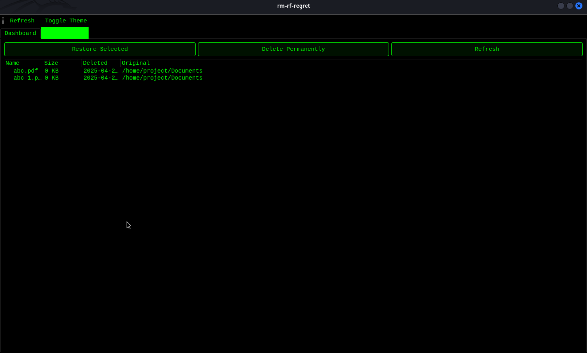

# RM-RF-REGRET

[](https://www.python.org/)  
[](https://riverbankcomputing.com/software/pyqt)  
[](LICENSE)

---

## 🚀 Project Overview

**RM-RF-REGRET** is a safe, user-friendly home-directory cleaner for Linux.  
It helps you reclaim disk space without fear of losing important data by providing:

- **Reversible deletions** (files moved to a Trash bin you can restore from)  
- **Real-time analytics**: multi-ring donut charts visualize disk usage by category  
- **Dual-pane GUI** for easy navigation and batch operations  
- **Theme customization** (Dark, Light, Hacker, Glass)

---

## ✨ Key Features

- **Safe Deletion**  
  - Moves files to `~/.rm_rf_trash` instead of permanent delete  
  - One-click restore or permanent purge  
- **Data Visualization**  
  - Donut-style charts by file category (Images, Documents, Videos, Audio, Archives, Others)  
  - Auto-refresh on directory changes  
- **Batch Operations**  
  - Multi-select delete, restore, refresh  
  - Filter by file type or size  
- **Theme Support**  
  - Built-in themes with customizable color palettes  
- **Command-Line Interface**  
  - Headless mode for scripts and automation

---

## 🛠 Technology & Tools

| Tool / Library    | Purpose                                     |
|-------------------|---------------------------------------------|
| Python 3.8+       | Core language for application logic         |
| PyQt5             | Desktop GUI framework                       |
| Matplotlib        | Generating donut charts & analytics         |
| pathlib           | Cross-platform filesystem path handling     |
| shutil, os        | File operations (move, delete, restore)     |
| logging           | Event logging and error reporting           |

---

## ⚙️ Installation

1. **Clone the repository**  
   ```
   git clone https://github.com/<your-username>/rm-rf-regret.git
   cd rm-rf-regret
   ```

2. **Create & activate a virtual environment**

   ```bash
   python3 -m venv venv
   source venv/bin/activate
   ```

3. **Install dependencies**

   ```bash
   pip install -r requirements.txt
   ```


## 🏃 Usage

1. **Launch the GUI**

   ```bash
   python prj.py
   ```

2. **Command-Line Mode**

   ```bash
   python cleaner.py --help
   # Example:
   # python cleaner.py --path ~/Documents --delete-all
   ```

3. **Available Commands**

   | Command                | Description                                |
   | ---------------------- | ------------------------------------------ |
   | `--path <directory>`   | Target directory (defaults to HOME)        |
   | `--delete-all`         | Move all files in target to Trash bin      |
   | `--restore <filename>` | Restore a file from the Trash bin          |
   | `--purge-trash`        | Permanently delete everything in Trash bin |

---

## 📸 Output Screenshots

> 
> *Disk usage breakdown by category*

> 
> *Review & restore deleted files*

---
